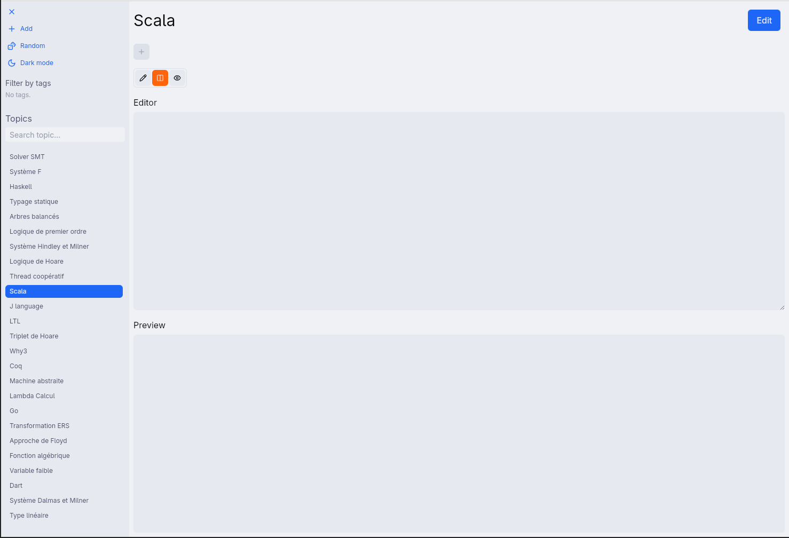
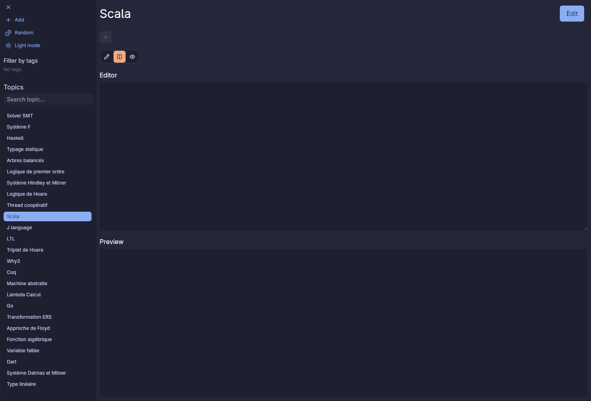

# RAM

`RAM` stands for Random Access Memory but refers in this context to an application for managing markdown notes in order to learn specific topics. New ones can be added (e.g., `type theory` or `red and black trees`) with a note attached and a random button helps distribute exploration evenly across all topics. All markdown files are stored localy in the `Documents` folder.

## Installation
> [!WARNING]
> The elfutils package must be installed on the system beforehand.

The `install.sh` script compiles the Tauri application for the target operating system. It removes previous build artifacts and compiles the application in `release mode`.
The resulting `AppImage` is copied to `~/programs/ram/ram.AppImage`, and a `.desktop` launcher is created or overwritten in `~/.local/share/applications` to allow launching the app from the system menu, even on Arch Linux :rocket:.

## The look

